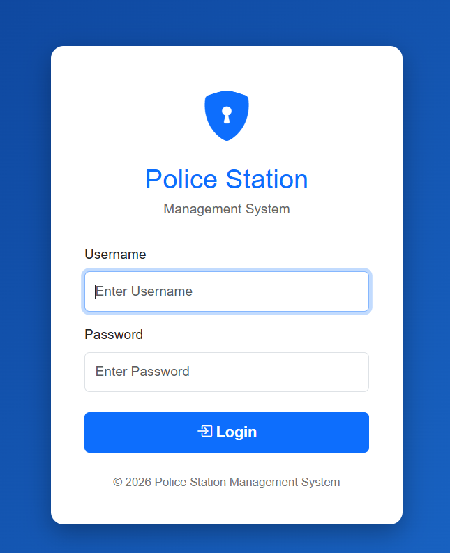
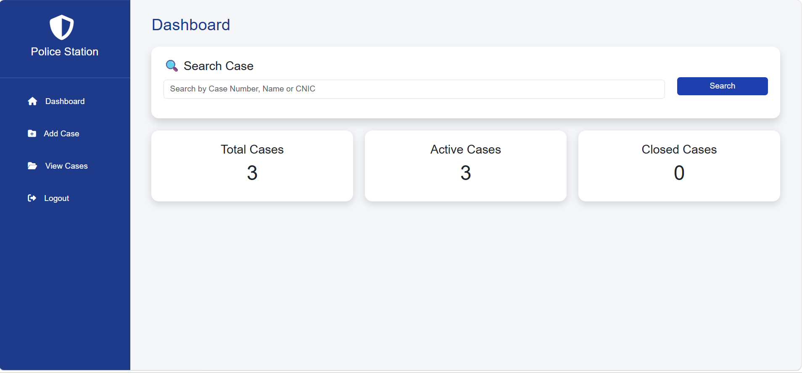
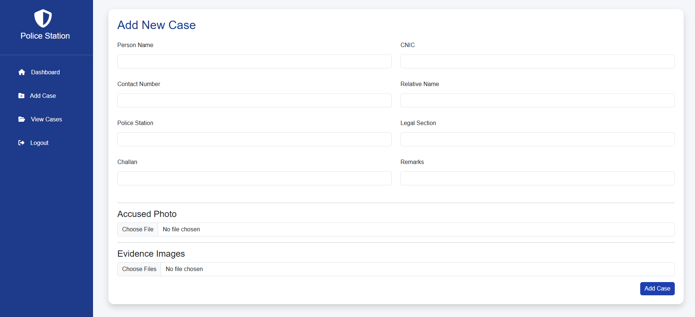
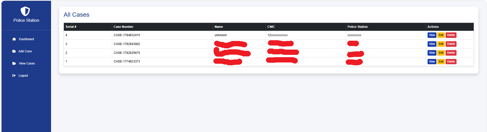
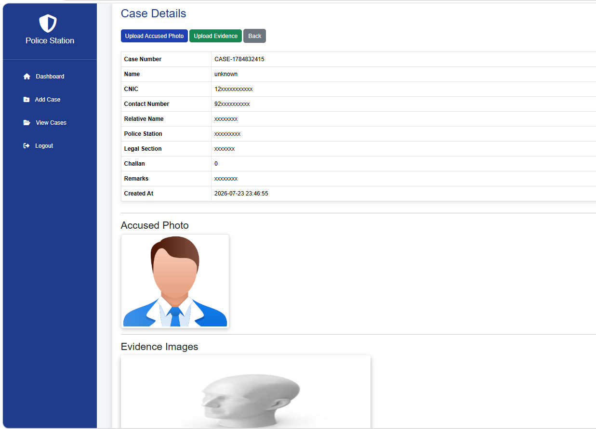

# Police Station Management System

A web-based Police Station Management System developed using PHP and MySQL.

## Screenshots
### Login Page

### Dashboard

### ADD CASE

### all case

### view case

## Features

- Admin authentication
- Case registration and management
- Search cases
- Update and delete case records
- Evidence upload system
- Accused information management
- Admin dashboard

## Technologies Used

- PHP
- MySQL
- HTML
- CSS
- JavaScript
- XAMPP/WAMP

## Database Setup

1. Create a MySQL database.
2. Import your database structure.
3. Rename:

includes/db_connect.example.php

to:

includes/db_connect.php

4. Add your database credentials.

## Developer
## Developer

Developed by **Aiman Wazir**

Role:
Full Stack Developer

Technologies:
PHP | MySQL | HTML | CSS | JavaScript

